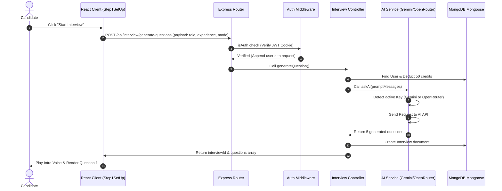

# InterviewIQ System Architecture 🏛️

This document describes the design patterns, folder structure, and architecture of the **InterviewIQ** platform to help you understand how the MERN stack and MVC (Model-View-Controller) structure are laid out.

---

## 🏗️ Design Philosophy: MERN + MVC

InterviewIQ is built as a **decoupled MERN stack application**, meaning the frontend (Client) and backend (Server) are entirely separate projects that communicate over HTTP/HTTPS using JSON.

- **M**ongoDB: Document database to store User profiles and Interview session reports.
- **E**xpress: Web application framework for routing HTTP requests.
- **R**eact: Component-based frontend framework representing the **View** layer.
- **N**ode.js: JavaScript runtime powering the backend.

### The MVC Pattern
To keep the backend organized, clean, and maintainable, we use the **Model-View-Controller (MVC)** architectural pattern:

1. **Model**: Defines the schema and structure of database documents (located in `server/models/`).
2. **View**: React serves as the client-side View. It handles rendering UI, user interactions, speech-to-text, and local transitions.
3. **Controller**: Contains the business logic, handles incoming requests, calls helper services, updates models, and sends responses (located in `server/controllers/`).
4. **Routes**: Decouples the request endpoints from the controller logic, directing matching URLs to their respective controllers (located in `server/routes/`).

---

## 📂 Codebase Directory Structure

```text
interview-iq/ (Root)
├── client/                     # Frontend (React + Vite)
│   ├── src/
│   │   ├── assets/             # Media assets (images, audio, videos)
│   │   ├── components/         # Reusable UI components & steps (Navbar, Footer, Steps 1-3)
│   │   ├── context/            # React Context (UserContext.jsx) replaces Redux
│   │   ├── pages/              # Main app pages (Home, Auth, Pricing, History)
│   │   ├── utils/              # Client utility files (e.g. Firebase config)
│   │   ├── App.jsx             # Main routing and global state checker
│   │   └── main.jsx            # React root mount point
│   └── package.json
│
└── server/                     # Backend (Node.js + Express)
    ├── config/                 # External service configs (DB connections, Token generators)
    ├── controllers/            # Controller layer (Business logic handlers)
    │   ├── auth.controller.js
    │   ├── interview.controller.js
    │   ├── payment.controller.js
    │   └── user.controller.js
    ├── middlewares/            # Request interceptors (Authentication checks, file upload)
    ├── models/                 # Database Schemas (MongoDB Mongoose models)
    │   ├── interview.model.js
    │   ├── payment.model.js
    │   └── user.model.js
    ├── routes/                 # API endpoint routing
    ├── services/               # Helper modules (AI integration)
    │   └── openRouter.service.js # Unified AI completion engine (Gemini & OpenRouter support)
    ├── index.js                # Server entry point
    └── package.json
```

---

## 🔄 Request & Response Lifecycle

Here is how a request moves through the system when a user initiates a mock interview:



---

## 🤖 Unified AI completion Engine

The AI service (`server/services/openRouter.service.js`) is designed to support multiple LLM backends dynamically. You can switch between them just by changing your environment variable (`.env`):

* **Google Gemini API**: Active if `GEMINI_API_KEY` is present. Uses the `gemini-2.5-flash` model via native REST calls.
* **OpenRouter API**: Fallback if `OPENROUTER_API_KEY` is present. Uses `gpt-4o-mini` via OpenRouter.

This provides high redundancy and flexibility without touching any of the controller or frontend code.
